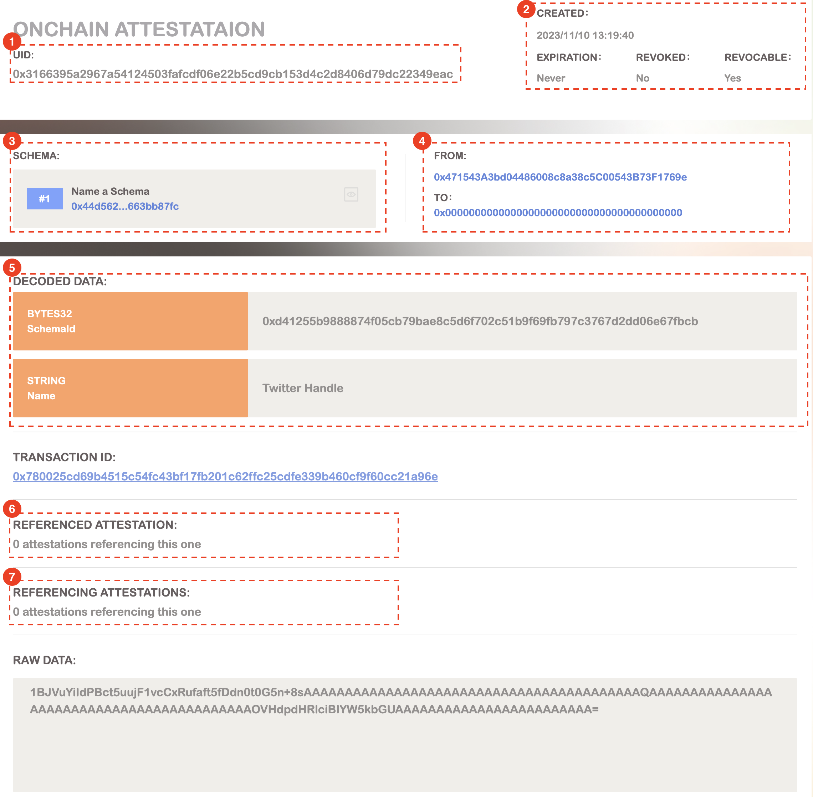

# Attestation

At its core, an attestation is a data with proof that can be used to verify the validity defined in schema. Attestation provide a standard for user to import any data into web3. With in BAS, attestations can be created onchain and offchain. Users can store the offchain attestations in greenfield to provide the attestations access control.

## When to use Attestations

Attestations serve as a bridge between web2 and web3, providing a standard method to verify and share users’ personal data. Here are some use cases:

- todo

## Examples

Here is an example onchain attestation record. It’s name a schema `0xd41…bcb` as Twitter Handle.

1. **UID:** Each attestation has its own unique identifier (UID) which is a hash of the entire attestation
2. **Status:** This can help you determine if the attestation is still valid and trustworthy, ensuring you have the most up-to-date information.
3. **Schema:** Schemas are the data of the attestation. They are completely customizable and can be created for any purpose, allowing users to leverage preexisting schemas or create new ones tailored to their specific needs.
4. **From & To:** These 2 fields indicate `from` generates the attestation for `to`. They are completely customizable and can be created for any purpose. Specifically in RIDO, `to` should be the owner of data (attestation).
5. **Attestation data:** The attestation data will be decoded in this section based on the schema.
6. **Referenced attestations:** One of the most powerful features of BAS is its ability to allow attestations to reference other attestation UIDs. This field shows the attestations that are linked to by current attestation.
7. **Referencing attestations:** This field shows the attestations that link to current attestation.

See how to create an attestation. //todo
