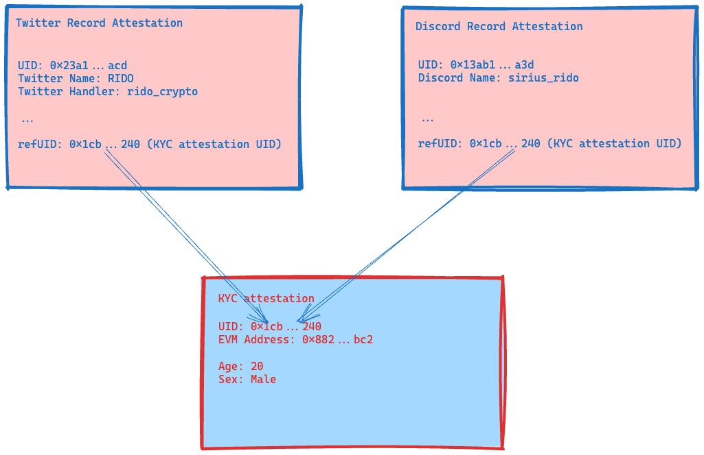
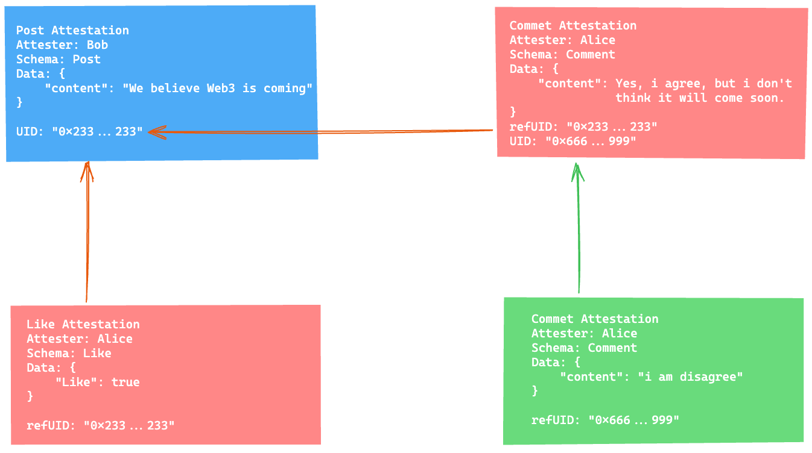

# Composability

Composability is an important feature of Web3. Developers can create their own elements. And others can construct more complex and intricate structure by combing existing basic elements. Just like LEGO, users can build anything using several existing basic pieces.

## How to compose attestations

User can use the `refUID` field to reference to another attestation. This help users to reuse existing attestations and create  more complex structure.

## Examples

### Compose different basic account attestation into more detail account info

Twitter record attestation and record attestation can reference an existing KYC attestation to give more information.

### Decentralized Social Media

Another use case is for social media platform. Bob can create a “post” attestation with uid 0x233…2233 representing his post. Alice can create a “like” attestation and a “comment” reference to  0x233…2233 respectively, representing Alice’s like and comment to Bob’s post. Meanwhile Anne also can create a “comment” attestation referencing to Alice’s comment as Anne’s recommend to Alice’s comment.

