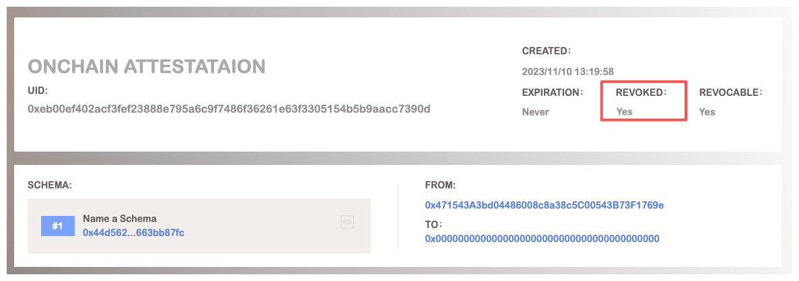

# Revocation

On BAS, users can revoke either onchain or off-chain attestations when they are no longer valid. Consider an attestation which claims Bob is a senior student. But when Bob graduate from school, the attestation should be revoked.

When user create an attestation, they can set if the attestation is revokable. Only the revokable attestation can be revoked.

As for onchain attestations, attesters of attestations can call `revoke` function of BAS contract to mark an attestation as invalid. When an onchain attestation is revoked, the `revoked` field will be set true.  While attester also can call `revokeOffchain(bytes32)` to revoke an off-chain attestation. Where the input of `revokeOffChain` is the uid of the attestation that you want to revoke. When an off-chain attestation is revoked, BAS contract will mark the attestation as revoked.

## Example

I give name to a schema, but i think a similar name has been used by another schema. So I can revoke current naming attestation and create a new one.

