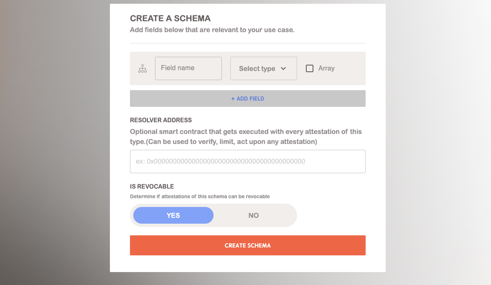

# Schema

Even a non-developer can master the power of attestations, thanks to BASCAN’s user-friendly interface. Crafting your schema can be done without any coding at all. This tutorial will provide a step-by-step process, making schema creation a breeze without needing to delve deep into the technical aspects.

## Create a Schema

1. **Access the Schema Builder:** Access TODO: add a link to connect your wallet and create a schema.
2. **Craft Your schema:** You can customize your schema content using the schema builder. This includes defining the fields of the schema, determining the type of each field, and deciding the order of these fields.
3. **Resolver Contract (Optional):** Choose whether to use a resolver contract to validate the data.
4. **Revocable:** Decide if you want attestations for your schema to be revocable.
5. **Create the Schema & Check on BASCAN:** Once you finish the previous steps, click `create schema`. Note that this will lead to a transaction to register your schema.

## Find a Schema

When users want to check the status of their schema or learn about certain schema content, they can easily and quickly find these schemas on BASCAN. Users can use BASCAN’s search function directly to find schemas, and their search methods can include the following:

1. **Search by Keyword:** When you want to find some interesting schemas, you can use keyword search. This will return a series of schemas sorted by relevance.
2. **Search by UID:** Users need to enter the complete and accurate UID of the schema to find the corresponding schema.
3. **Search by `Schema #`**: Users need to enter the accurate `Schema #` to find the corresponding schema.

    

<aside>

    💡TIPS: 
    Before creating your schema, you can use BASCAN to check if similar schemas have already been created and are in use. This will help you avoid duplicating efforts and ensure that you can leverage existing schemas if they meet your requirements.
</aside>