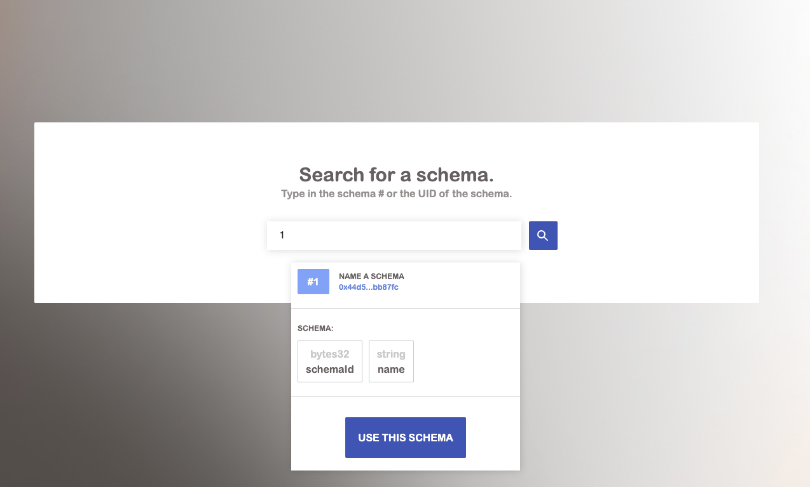
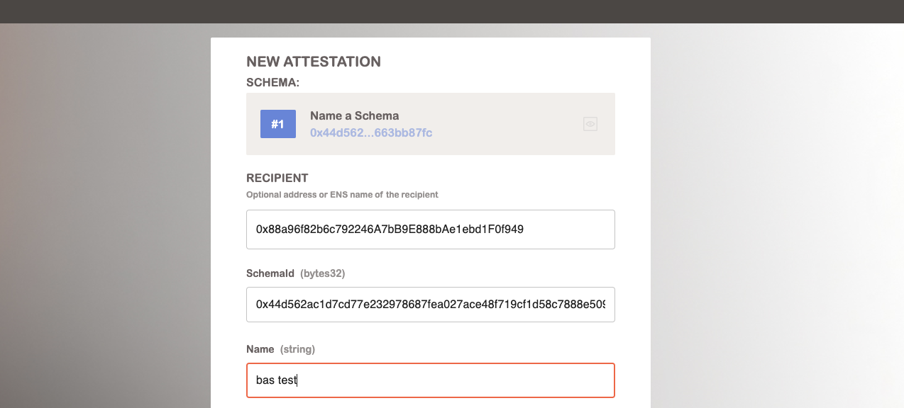
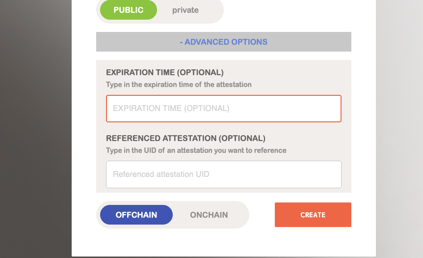
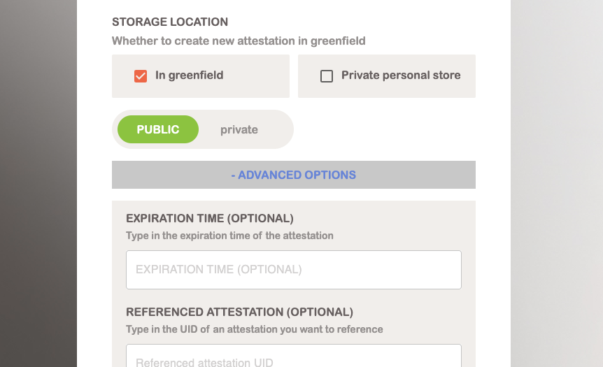
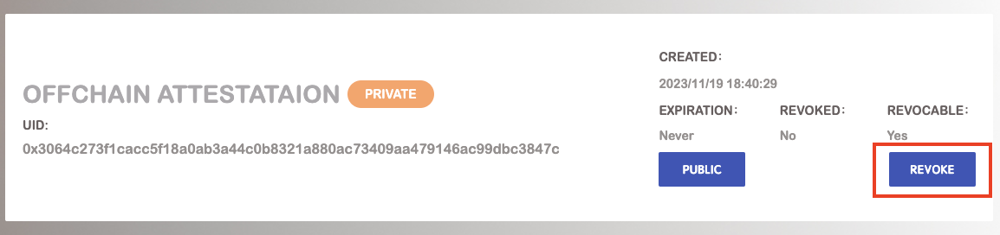
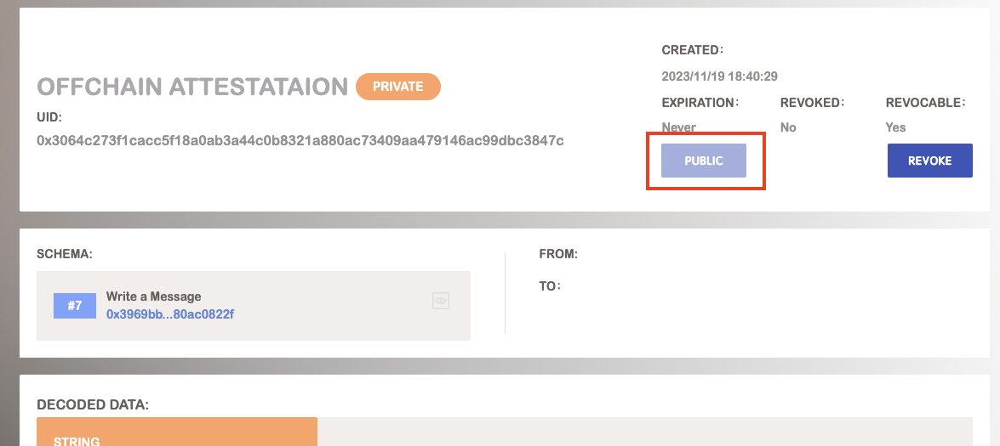

# Attestation

BAS provides a convenient method for creating attestations without any code or development skills required. All you need is a wallet.

## Find the Attestation

Users can find an attestation by UID in search box.

## Make an Attestation

1. **Find the Schema:** At the first step, You’re supposed to find out the schema you want to attest with. User can create an attestation in schema detail page or search the schema you want directly.
    

2. **Fill in the Attestation Record:** Specify the recipient (optional), and then fill in each field specified by the schema.
    

3. **Additional Options:** This section will allow you to do a few special things:
    1. Add an `expiration time`. Which sets a specific time when the attestation will expire.
    2. Add a `Referenced Attestation UID`. This allows you to build **[modular and composable attestations](https://docs.attest.sh/docs/core--concepts/composability)**.
    

4. **On-chain v.s. Off-chain:** Decide to make the attestation onchain or off-chain. And when user choose to create an off-chain attestation and store in Greenfield, he can set the visibility as public so that anyone can access to it or private so that only the authorized people can view.
    

5. Once you finish the previous steps, click the “Make Attestation”. Then you can get your attestation for the target schema.

## Revoke an Attestation

User can revoke the attestations they want in the attestation detail page. When the attestation is revoked, it would be invalid.

## Public/Privatize the Off-chain Attestation

After a user create an off-chain attestation and store it in greenfield, he can change the visibility in attestation detail page.

## Share Private Attestations

Coming Soon!
